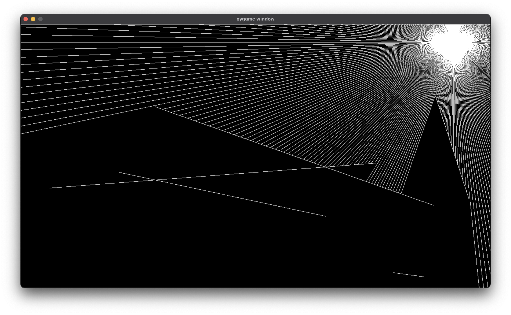

# Ray Casting
A raycast simulation written in PyGame, Python

## Setup
1. Install the required libraries: `pip3 install -r requirements.txt`
2. Run `main.py`: `python3 main.py`

## Screenshots
</img>
</img>

## License
This project is licensed under the GNU-3.0 license. Read more about it [here](LICENSE)